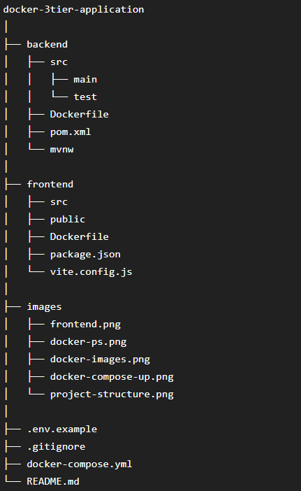
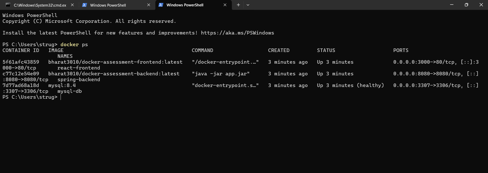
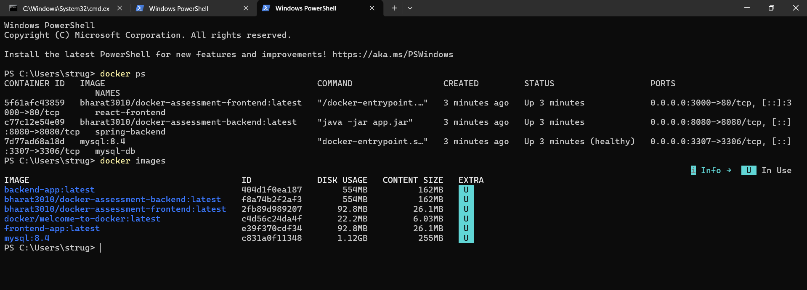
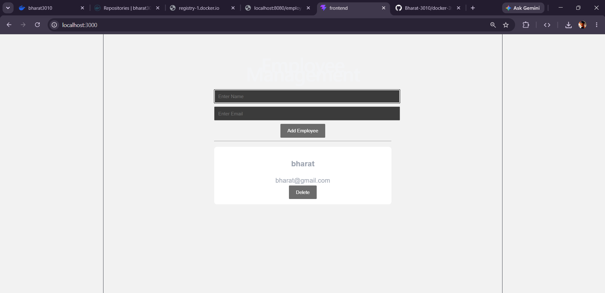
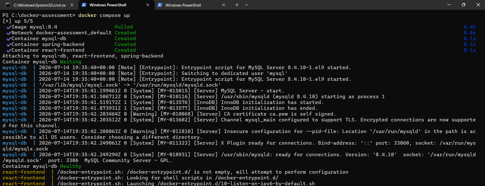

# Docker Assessment – 3-Tier Employee Management Application

## Project Overview

This project demonstrates the deployment of a **3-tier web application** using **Docker Compose**.

The application consists of:

- **Frontend:** React + Axios + Nginx
- **Backend:** Spring Boot REST API
- **Database:** MySQL 8.4

The frontend communicates with the backend through REST APIs, and the backend performs CRUD operations on the MySQL database.

---

# Architecture

```text
                    +----------------------+
                    |      React App       |
                    |   (Nginx Container)  |
                    +----------+-----------+
                               |
                     HTTP REST API
                               |
                               v
                    +----------------------+
                    |  Spring Boot API     |
                    |   (Java Container)   |
                    +----------+-----------+
                               |
                          JDBC Connection
                               |
                               v
                    +----------------------+
                    |     MySQL 8.4        |
                    |   Database Container |
                    +----------------------+
```

---

# Tech Stack

| Layer | Technology |
|--------|------------|
| Frontend | React, Axios, Vite, Nginx |
| Backend | Spring Boot, Spring Data JPA |
| Database | MySQL 8.4 |
| Containerization | Docker |
| Orchestration | Docker Compose |

---

# Project Structure

```text
docker-assessment/
│
├── backend/
│   ├── Dockerfile
│   ├── src/
│   └── pom.xml
│
├── frontend/
│   ├── Dockerfile
│   ├── src/
│   └── package.json
│
├── docker-compose.yml
├── .env.example
├── README.md
└── .gitignore
```

---

# Docker Images

## Backend

https://hub.docker.com/r/bharat3010/docker-assessment-backend

## Frontend

https://hub.docker.com/r/bharat3010/docker-assessment-frontend

---

# Features

- Add Employee
- View Employees
- Delete Employee
- REST API
- Dockerized Backend
- Dockerized Frontend
- Persistent MySQL Database
- Named Docker Volume
- Environment Variables
- Docker Health Check

---

# Environment Variables

Create a `.env` file.

```properties
MYSQL_DATABASE=employee_db
MYSQL_ROOT_PASSWORD=root

SPRING_DATASOURCE_URL=jdbc:mysql://db:3306/employee_db
SPRING_DATASOURCE_USERNAME=root
SPRING_DATASOURCE_PASSWORD=root
```

---

# Run the Application

Clone the repository.

```bash
git clone <https://github.com/Bharat-3010/docker-3tier-application.git>
```

Move into the project.

```bash
cd docker-assessment
```

Start the application.

```bash
docker compose up
```

Open:

Frontend

```
http://localhost:3000
```

Backend

```
http://localhost:8080/employees
```

---

# Docker Compose Services

| Service | Image | Port |
|----------|-------|------|
| frontend | bharat3010/docker-assessment-frontend | 3000 |
| backend | bharat3010/docker-assessment-backend | 8080 |
| db | mysql:8.4 | 3307 |

---

# Docker Features Used

- Multi-stage Dockerfile
- Docker Compose
- Named Volume
- Environment Variables
- Health Check
- Restart Policy
- Docker Networking

---

# Screenshots

## Project Structure

> 




## Docker Containers Running

>




## Docker Images

> 




## React Application

> 




## Docker Compose Up

> 



---

# Author

**Bharat Mohite**

DevOps & Java Backend 

GitHub:
https://github.com/Bharat-3010

Docker Hub:
https://hub.docker.com/u/bharat3010